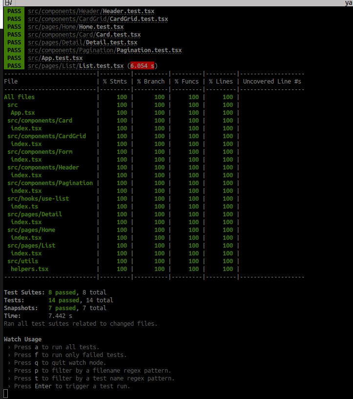

# Rick and Morty

### Como executar o projeto

É necessário que já tenha clonado o projeto e com o ambiente NPM/Yarn configurado.

Para executar o front utilize esse comando `yarn start`

Para executar os testes unitários utilize esse comando `yarn test`

Aqui a baixo tem uma animação de como ficou o projeto, para caso de algum tipo de problema e não dê para levantar.

A cobertura dos arquivo foi atingida em 100%

